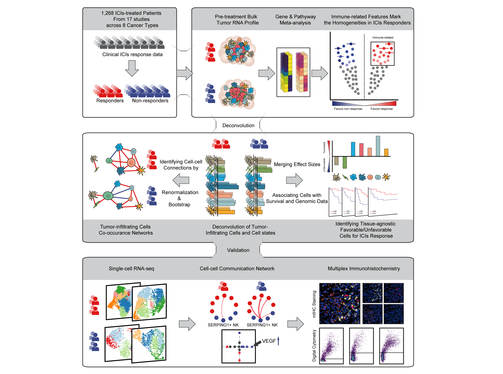

# ICIsAtlas

{align="middle" width="508"}

## Overview

**ICIsAtlas** is an R package for visualizing and analyzing immune checkpoint inhibitors (ICIs) response data across multiple studies and types of cancers\
It provides tools to display differential gene expression, pathway enrichment, survival analysis, and to recover tumor microenvironment cell states and FavTME score from bulk expression using [EcoTyper](https://github.com/digitalcytometry/ecotyper) pipeline.

------------------------------------------------------------------------

## Installation

Install the latest version from GitHub:

```{r, eval=FALSE}
# install.packages("devtools") 
devtools::install_github("Yumo-Xie/ICIsAtlas")
```

Main Functions

🔹 showDEG() Plots meta‑analysis differential expression for a single gene across studies.

🔹 showDEP() Plots pathway enrichment meta‑analysis results.

🔹 survplot() Draws Kaplan--Meier survival curves stratified by cell states or TME metrics.

🔹 recover_cellstates() Recovers EcoTyper cell states and computes the FavTME score from bulk RNA‑seq counts/TPM/FPKM/array.

```{r, eval=FALSE}
library(ICIsAtlas)

# (Optional) Download the large DEG_meta dataset (only once, cached after)
download_DEG_meta()

# Plot a meta-analysis differential expression forestplot for a gene
showDEG(gene = "PDCD1", Type = "Pan-cancer")

# Plot pathway enrichment results
showDEP(Pathway = NULL, Top = 5, Type = "Pan-cancer")

# Draw Kaplan–Meier survival curves
survplot(survival = "PFS", type = "FavTME", cut = "median", by.study = TRUE)

# Recover cell states from bulk expression
data(example_mat, package = "ICIsAtlas")
res <- recover_cellstates(expr = example_mat, expr_type = "counts", threads = 2)

```

License GPL (≥ 3)
